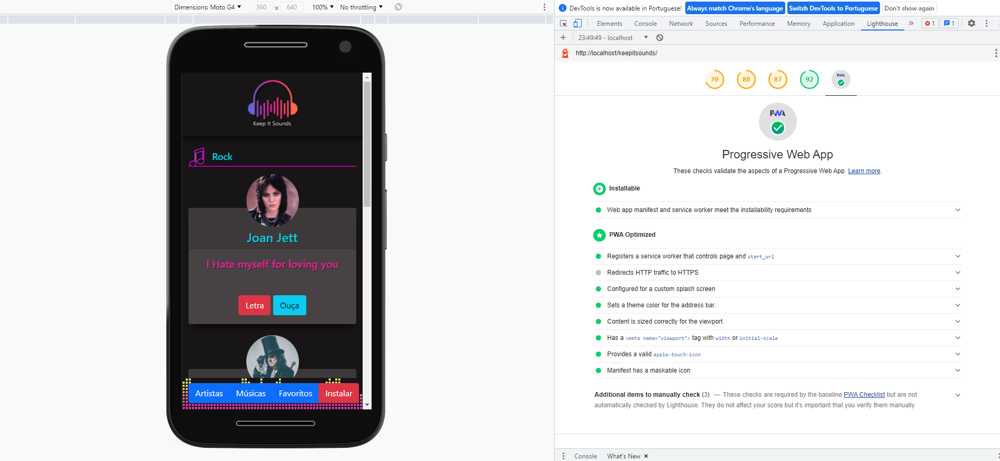

# keepitsounds

Esse é um projeto experimental de um aplicativo PWA para organização de playlist musicais.

### O que é PWA

Numa explicação rápida, PWA é um tipo de aplicativo web que utiliza recursos do navegador para criar cache dentro do dispositivo do usuário permitindo que o site permaneça acessível mesmo quando não houver conexão de internet. Para isso, ele precisa de permissões de acesso à recursos protegidos do navegador, então precisa ser instalado.

Visivelmente uma diferença entre aplicativos web normais e aplicativos web progressivos é o botão de instalar que aparece ao lado da barra de endereço do navegador.

### Preview

É possível ver o aplicativo rodando através do [link](https://phduarte.github.io/keepitsounds).

Abaixo é possível ver a validação do PWA pelo lighhouse do Google Chrome.

### Mais sobre PWA

- [Crie aplicativos Web progressivos com ASP.NET CoreBlazor WebAssembly](https://docs.microsoft.com/pt-br/aspnet/core/blazor/progressive-web-app?view=aspnetcore-5.0&tabs=visual-studio)
